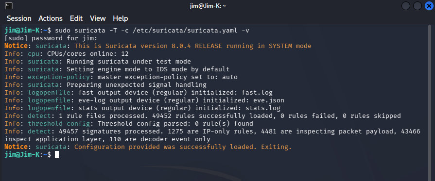
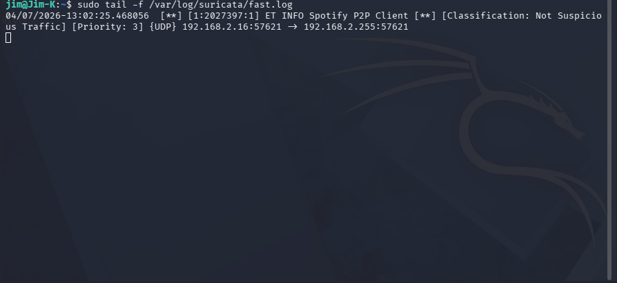
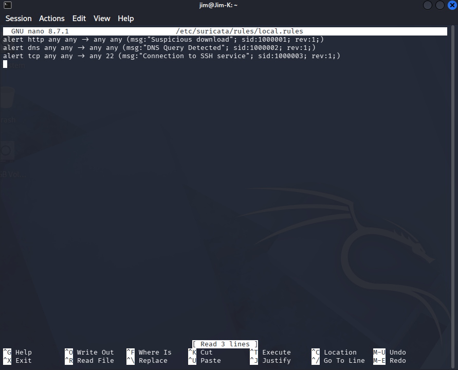

# 🛡️ Suricata IDS Lab

## 📌 Overview
This repository documents a basic Suricata IDS lab built in Kali Linux. It includes rule validation, custom rule creation, alert monitoring, and example commands used during setup and testing.

## 🎯 Objectives
- Install and validate Suricata in Kali Linux
- Load default and custom rules
- Monitor IDS alerts
- Practice basic network threat detection workflow

## 🛠️ Tools Used
- Kali Linux
- Suricata
- Linux terminal
- Fast log / EVE JSON output

## 🧠 Skills Demonstrated
- IDS setup and validation
- Rule-based detection
- Linux command-line usage
- Alert log monitoring
- Basic SOC workflow

## 📂 Repository Contents
- `setup-and-validation.md` – installation and validation notes
- `custom-rules.rules` – sample custom Suricata rules
- `sample-alerts.md` – example alert monitoring workflow
- `kali-commands.md` – commands used during the lab

## 🖼️ Evidence
### Suricata Test Mode Success

### Fast Log Monitoring

### Local Rules Example

